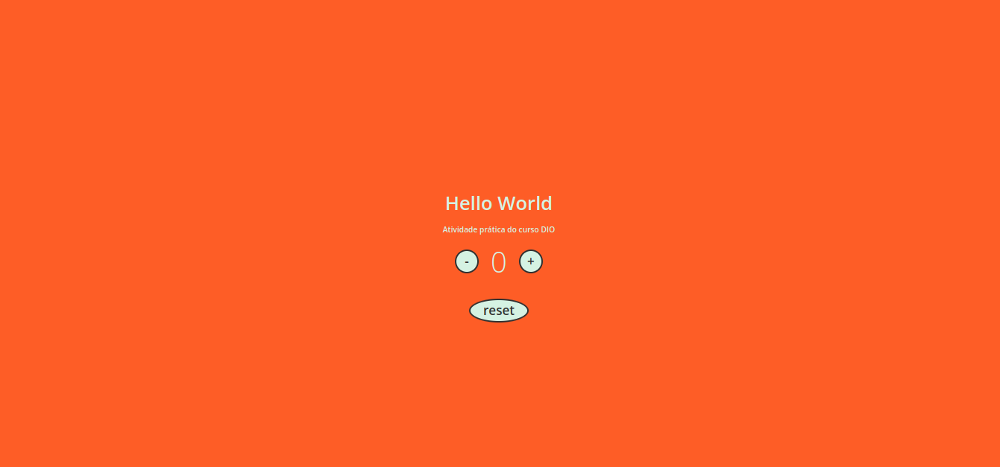

<h1 align="center">Contador</h1>

  <a href="#dart-about">About</a> &#xa0; | &#xa0;
  <a href="#rocket-technologies">Technologies</a> &#xa0; | &#xa0;
  <a href="#memo-license">License</a> &#xa0; | &#xa0;
  <a href="https://github.com/eduardopvieira16" target="_blank">Author</a>

 

## :dart: About ##

Projeto criado no curso básico de javascript. Curso apresentado pela Stephany Nusch na plataforma da DIO - Digital Innovation One

Aplicação de contador:

## :rocket: Technologies ##

The following tools were used in this project:

- HTML
- CSS
- JAVASCRIPT

## :memo: License ##

This project is under license from MIT. For more details, see the [LICENSE](LICENSE.md) file.

Made with :heart: by <a href="https://github.com/eduardopvieira16" target="_blank">Eduardo Vieira</a>

&#xa0;

<a href="#top">Back to top</a>
